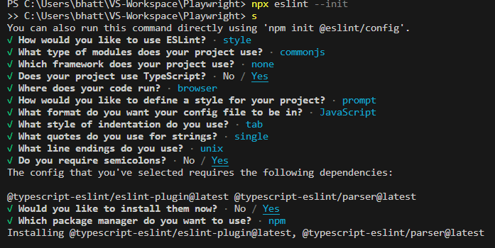
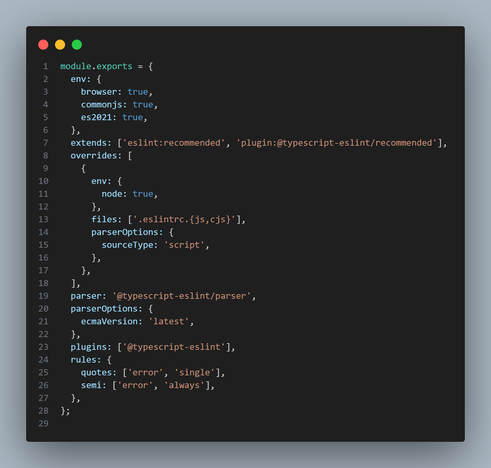

# Type of runners:

1. head less- npx playwright test PATH
2. Headed- npx playwright test --headed PATH
3. Playwright UI Screen: npx playwright test --ui PATH ----- Can filter and run any test case
4. Playwright Trace - npx playwright test --headed --trace on PATH ----- Instead of using trace on , we can enable this from playwright config using a key "trace"

# ESLint — For code quality

npm install eslint --save-dev

For the recommended linter use the extend object and for a specifics ones use rule
The eslint file looks like: 

Use playwright recommended plugin for recommended rules: [extends:"plugin:playwright/recommended"]
Recommeded Rules :
https://eslint.org/docs/latest/rules
https://typescript-eslint.io/rules/?=recommended
https://www.npmjs.com/package/eslint-plugin-playwright

# Prettier — For advance code formatting i.e. file based

Prettier is a well-known code formatter that supports a variety of different programming languages. It helps us avoid manually formatting our code by automatically formatting it based on a specified code style.

- npm install --save-dev prettier
- create a file called .prettierrc.json

- {
  "semi": false, // Specify if you want to print semicolons at the end of statements
  "singleQuote": true, // If you want to use single quotes
  "arrowParens": "avoid", // Include parenthesis around a sole arrow function parameter
  }
- Add script as : "format": "prettier --ignore-path .gitignore --write \"\*_/_.+(js|ts|json)\""

**NOTE**: For autosaving install prettier extension and add below lines in the Preferences: Open User Settings (JSON) -
// settings.json

- "editor.formatOnSave": true,
  "[javascript]": {
  "editor.defaultFormatter": "esbenp.prettier-vscode"
  },
  "[typescript]": {
  "editor.defaultFormatter": "esbenp.prettier-vscode"
  }

# Avoiding conflicts when working with ESLint and Prettier

The best solution here is to use the eslint-config-prettier plugin to disable all ESLint rules that are irrelevant to code formatting, as Prettier is already good at it:

- npm install --save-dev eslint-config-prettier
- Add prettier in eslint config
- "extends": ["eslint:recommended", "plugin:@typescript-eslint/recommended", "prettier"],

# PRE COMMIT GIT HUSKY

Git Husky is a tool that allows you to add pre-commit and pre-push hooks to your Git repository. These hooks enable you to run scripts or commands automatically before committing or pushing changes to the repository. Husky simplifies the process of enforcing code quality standards, running tests, or performing other checks as part of your Git workflow

- npm install --save-dev husky

* husky init : The init command simplifies setting up husky in a project. It creates a pre-commit script in .husky/ and updates the prepare script in package.json. Modifications can be made later to suit your workflow.
  \*- npx husky init

# API mocking

-Key Methods
page.route(url, handler): Intercepts requests matching the given URL pattern.
url: A string or regex pattern for matching requests.
handler(route, request): A function to handle the intercepted request.

- route.continue(): Proceeds with the request.
- route.abort(): Aborts the request.
- route.fulfill(options): Responds with mock data.
